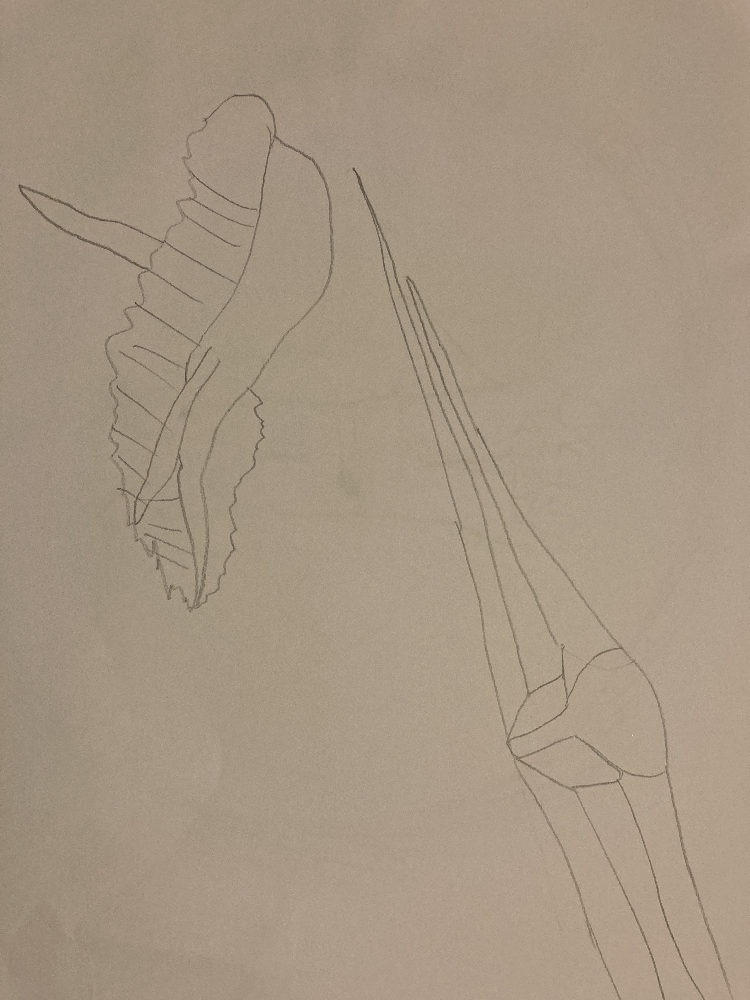

_Games Engines 2 Assignment in Final Year of Bachelor of Computer Science_

**Name:** Bianca Claudette Palileo

**Student Number:** C18326906

**Class Group:** DT228/4 or TU856/4

# Avengers Endgame

## Description
- A recreation of the Avengers Endgame final battle scene in Unity with autonomous agents and 3D models of the ships. 
- There have been adjustments in the storyline and scenes due to time.
- The spaceships and models apply steering behaviours such as fleeing, pursuing, obstacle avoidance, seek and arrive; and spine animations on a certain ship, written and applied in code.
- The spaceships were created in Blender, and the models were taken from Sketchfab and RenderHub.

## I am Most Proud of

I am most proud of recreating a story, creating the models, coding the sequence of events and steering behaviours to fit the requirements of the scene, and finding the right soundtrack for the scenes with the amount of time I was given, and with my full effort.

## How to Use

1. Load the project into Unity.
2. Start at "6OutriderShips".
3. Press Play
4. The end is "15SceneEnd".

## Videos
**Source movie:** Avengers Endgame

**Source videos:**

 Scene")

**Project Video:**

## Storyboard

<!--  -->
<!--  -->
<!--  -->
<!--  -->
<!--  -->
<!--  -->
<!--  -->
<!--  -->
<!--  -->
<!--  -->
<!--  -->

### Event Summary
1. Cut to Thanos' tallest ship landing on Earth and Outriders leaving ship.
2. Cut to Thanos' biggest ship in sky with flying whales.
3. Remaining superheroes and their ships go through the portals.
4. Shot of everyone and ships going to the center.
5. Shooting stops from Thanos' biggest ship.
6. Captain Marvel flies in and destroys Thanos' biggest ship.
7. Flash white.
<!-- 1. Ironman, Thor (both Stormbreaker and Mjolnir), Captain America get together to fight Thanos. -->
<!-- 2. Thor supercharges Ironman with lightning. -->
<!-- 3. Ironman lasers Thanos and Thanos throws Ironman away; Ironman passes out.  -->
<!-- 4. Thor and Thanos fight; gets thrown away. -->
<!-- 6. Captain America gets Thor's hammer and fights Thanos; lightning on Thanos but also gets thrown away. -->
<!-- 9. Cut to Doctor Strange opening portals for the other superheroes. -->
<!-- 12. Hulk gets massive from under a platform. -->
<!-- 13. Captain America says 'Avengers Assemble'. -->
<!-- 15. Hulk smashes a flying whale and it crashes onto enemy territory. -->
<!-- 16. Ironwoman shoots a different flying whale and partners with Ironman to shoot lasers at Outriders. -->
<!-- 17. Wanda holds Thanos in the air. -->
<!-- 18. Thanos calls an airstrike from the biggest ship; shoots everyone. -->
<!-- 19. Doctor Strange makes shields to protect the superheroes. -->
<!-- 22. Ironman, Ironwoman and Wanda destroy ships and flying whales. -->
<!-- 23. Ironman, Thor (with stormbreaker), Captain America (with Mjolnir) fight Thanos once more. -->
<!-- 24. Captain Marvel deals final blow. -->

## How it Works

### Sequence

* Certain GameObjects such as cameras and ships, and certain conditions in the scene call the SceneManager.LoadScene() function to load the next scene.
* These scenes are added to the Build Settings and were built to be used in the project.

### Steering Behaviours

* Steering Behaviours are added to the GameObject who hold a Boid; scripts such as Flee, Pursue, Seek, Arrive, Obstacle Avoidance.
* Boid calculates and applies banking and the Steering Behaviour forces to the GameObject.
* Flee adds a force to the GameObject to go away from the target position.
* Pursue adds a force to the GameObject to go to a certain GameObject who has a Boid script.
* Seek adds a force to the GameObject to push it to a target position.
* Arrive adds a force to the GameObject to push it to a target position but slows down when the GameObject enters a certain distance from the target position by decelerating until it reaches the target position.
* Obstacle Avoidance has 5 feelers, and when these feelers are touched by a selected layermask, the GameObject avoids this GameObject.
* A Finite State Machine was used for the Avenger ships as they had a Flee and Seek Steering Behaviour script. The statemachine allowed the switching and prioritizing of the Flee state and Seek state depending on the amount of bullets that the Avenger ship had left and the distance from any Leviathan.

### Weapons

* The Avenger ships target and shoot bullets with a blue-green trail renderer when they see a Leviathan with a "leviathan" mask if they are 90 degrees in view and less than 200 units away.
* The Leviathans eat and run into Avenger ships to destroy them.
* The SanctuaryII ship has 4 cannons that are charged using particle systems; red bullets are then released with the Seek Steering Behaviour to target and destroy the Avenger ships.

### Design

* Particle systems are used for the portals, the explosion and the cannons on the SanctuaryII ship.
* The skybox was changed to stars to make the scene space-like.
* There are trail renderers on the bullets and on Captain Marvel herself.
* Some materials had to be created such as the material for the Leviathans, terrain, bullets and portal door.
* In "9AvengersAssemble", the ships start with alpha 0 and slowly return to alpha 1 to create the effect of passing through a portal.

### Audio

* In each scene, every camera contains an Audio Source to play the respective soundtrack.
* Certain GameObjects also contain an AudioSource such as to play the sounds for the Outriders and Thanos' ships in the first scene.

### Animations

* There is a spine animator on the Leviathan that takes the children and transforms them at an offset to create a harmonic motion.

## Classes

| Class / Assets  | Source  |
|---|---|
| AlphaChange.cs  | Self written  |
| Arrive.cs  | Modified from college course  |
| AvengerShip.cs  | Self written  |
| AvengerShipFight.cs  | Self written  |
| AvengerShipSpawner.cs  | Self written  |
| AvengerShipSpawnerFight.cs  | Self written  |
| AvengerSpawnerFinal.cs  | Self written  |
| Boid.cs  | Modified from college course  |
| Bullet.cs  | Self written  |
| ChargeBullet.cs  | Self written  |
| ChargeBulletCamera.cs  | Self written  |
| ClosePortal.cs  | Self written  |
| EndCamera.cs  | Self written  |
| Flee.cs  | Modified from college course  |
| LeviathanFight.cs  | Self written  |
| LeviathanSpawner.cs  | Self written  |
| LeviathanSpawnerFight.cs  | Self written  |
| LeviathanSwitchScene.cs  | Self written  |
| NoiseWander.cs  | Modified from college course  |
| ObstacleAvoidance.cs  | Modified from college course  |
| Outrider.cs  | Self written  |
| PortalCamera.cs  | Self written  |
| PortalSpawner.cs  | Self written  |
| Pursue.cs  | Modified from college course  |
| SanctuaryII.cs  | Self written  |
| Seek.cs  | Modified from college course  |
| ShipIArrive.cs  | Modified from college course  |
| ShipIBoid.cs  | Modified from college course  |
| ShipICamera.cs  | Self written  |
| ShipILand.cs  | Self written  |
| ShipISpawner.cs  | Self written  |
| ShipISteeringBehaviour.cs  | Modified from college course  |
| SpineAnimator.cs  | Modified from college course  |
| StateMachine.cs  | Modified from college course  |
| SteeringBehaviour.cs  | Modified from college course  |
| TriggerExplosion.cs  | Self written  |

## Models
### SketchFab

Captain Marvel

 
<!-- |   |  |   |  |
| ------------- | ------------- | ------------- | ------------- |
|  Ironman  |  Thor, Mjolnir (Hammer) and Stormbreaker(Axe)  |  Captain America  |  Thanos  |
|  Doctor Strange  |  Black Panther  |  Nebula  |  Spiderman  |
|  Starlord - Peter Quill  |  Hulk  |  Ironwoman - Pepper Potts  |  Captain Marvel  | -->

### RenderHub

Outriders

<!-- - Wanda
  -  -->

### Blender - **Created by Me**
- Sanctuary II (Thanos' main ship)
  - 
- Thanos' outrider-full ship
  - 
- Thanos' whale ships/monster
  - 
- Avengers' spaceships 2x
  - 
  - 

## Resources
- Assets
  - [**Sketchfab**](https://sketchfab.com/feed)
  - [**RenderHub**](https://www.renderhub.com)
  - [**Blender**](https://www.blender.org/)
  - [Skybox](https://assetstore.unity.com/packages/2d/textures-materials/sky/starfield-skybox-92717)

- Soundtrack
  -  Avengers Infinity War
  -  Avengers Endgame
